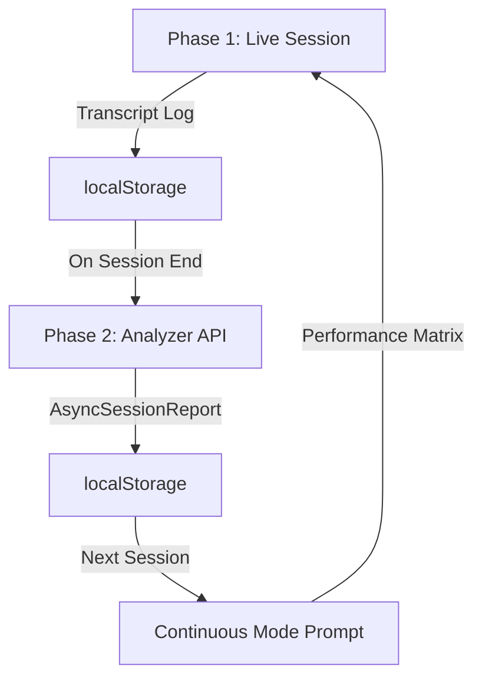

# Async Analysis Architecture - Refactoring Overview

## Branch: `feature/async-analysis`

## 🎯 Project Goal
Transform the RP Coach from **synchronous JSON metrics** (causing latency) to **asynchronous post-session analysis** with zero-latency live sessions.

---

## 📚 Documentation Structure

### 1. [PHASE_1_IMPLEMENTATION_PLAN.md](./PHASE_1_IMPLEMENTATION_PLAN.md)
**Focus:** Eliminate Live Session Latency
- Remove JSON metrics reporting from live sessions
- Add verbal feedback mandate (explicit "Correct", "Incorrect", "Almost")
- Implement transcript logging (speaker + timestamp + text)
- **Outcome:** Faster, more natural conversations

### 2. [PHASE_2_IMPLEMENTATION_PLAN.md](./PHASE_2_IMPLEMENTATION_PLAN.md)
**Focus:** Deep Post-Session Analysis
- Create `/api/analyze-session` endpoint
- Implement hierarchical categorization (Phonetics > Intonation > Stress)
- Calculate weighted accuracy scores
- Inject condensed report into next session
- **Outcome:** Data-driven continuity with intelligent focus

---

## 🔄 Implementation Workflow



---

## 📊 Data Flow

### Old Architecture (Synchronous)
```
User speaks → Gemini analyzes → Gemini responds WITH JSON → Client parses JSON
                                    ↑ LATENCY ↑
```

### New Architecture (Asynchronous)
```
LIVE SESSION:
User speaks → Gemini responds with verbal feedback → Transcript logged
                        ↓ ZERO LATENCY ↓

POST-SESSION:
Transcript → Gemini Text API → Structured Analysis → AsyncSessionReport

NEXT SESSION:
Report → Performance Matrix → Focused Drills
```

---

## 🆕 New Data Structures

### TranscriptEntry
```typescript
{
  timestamp: number;        // Unix timestamp
  speaker: 'user' | 'model'; // Who spoke
  text: string;             // What was said
}
```

### AsyncSessionReport
```typescript
{
  session_id: string;
  categories: {
    phonetics: {
      weighted_score: 55,     // 0-100%
      items: [
        { name: "/r/", attempts: 10, score: 40, status: "NEEDS_WORK" }
      ]
    },
    intonation: { ... },
    stress_rhythm: { ... }
  },
  qualitative_notes: "Brief summary",
  next_session_recommendation: {
    primary_focus: "Non-rhotic /r/",
    secondary_focus: "Question intonation",
    warmup_topic: "Minimal pairs: car vs cah"
  }
}
```

---

## 🧮 Key Formulas

### Item Score (Simple Average)
```
score = (Σ attempt_scores) / number_of_attempts
```

### Category Score (Weighted Average)
```
weighted_score = Σ(item_score × item_attempts) / Σ(all_attempts_in_category)
```

**Example:**
- `/r/`: 40% (5 attempts) → 40 × 5 = 200
- `/ɔː/`: 80% (4 attempts) → 80 × 4 = 320
- **Phonetics Category**: (200 + 320) / 9 = **57.8%**

---

## 🎓 Hierarchical Categorization

**STRICT PRIORITY ORDER** (never mix):

1. **Phonetics** - Individual sounds
   - Examples: `/r/`, `/ɔː/`, `/θ/`, `/æ/`
   - Use IPA notation

2. **Intonation** - Pitch patterns (use TYPES)
   - Types: "Wh-Question", "Yes/No Question", "Statement"
   - NOT full sentences (to save tokens)

3. **Stress & Rhythm** - Word stress and timing
   - Specific words: "Photograph", "Photography"
   - Pattern types: "Iambic", "Weak Forms"

---

## ✅ Implementation Checklist

### Phase 1: Live Session (LATENCY REMOVAL)
- [ ] Update types (TranscriptEntry, AnalysisItem, CategoryResult, AsyncSessionReport)
- [ ] Remove JSON mandate from prompt
- [ ] Add verbal feedback mandate
- [ ] Implement transcript logging in hook
- [ ] Remove JSON parsing logic
- [ ] Add transcript viewer (optional, for debugging)
- [ ] Test: No JSON errors, faster responses, transcript saves

### Phase 2: Async Analysis (INTELLIGENCE)
- [ ] Create `/api/analyze-session` endpoint
- [ ] Implement analyzer prompt with formulas
- [ ] Add formatCategory helper
- [ ] Update buildContinuousMode to use report
- [ ] Trigger analysis on session end
- [ ] Load report in next session
- [ ] Test: Correct categorization, accurate scores, intelligent focus

---

## 🧪 Testing Strategy

### Phase 1 Tests
1. **Baseline:** No console errors, audio works both directions
2. **Verbal Feedback:** Coach says "Correct", "Incorrect", "Almost"
3. **Transcript Logging:** localStorage has complete transcript
4. **No Latency Regression:** Responses feel faster

### Phase 2 Tests
1. **Mock Transcript:** Known corrections → verify scores
2. **Category Priority:** Phonetics before intonation
3. **Weighted Math:** Manual calculation matches report
4. **Continuity:** Next session briefs on performance matrix
5. **Empty Categories:** Intonation/stress = 0 if not addressed

---

## 🚀 Deployment Strategy

1. **Phase 1 First**
   - Test thoroughly on dev
   - Ensure no regressions
   - Commit with clear messages
   - Push to remote

2. **Test Before Phase 2**
   - Validate transcript quality
   - Confirm verbal feedback is explicit enough

3. **Phase 2 Second**
   - Implement in separate chat session
   - Test analyzer with real transcripts
   - Verify formula accuracy

4. **Final Merge**
   - Merge to master
   - Deploy to Vercel
   - Monitor for issues

---

## 🔑 Key Principles

1. **Separation of Concerns:** Live UX ≠ Analysis accuracy
2. **Data First:** Transcript is source of truth
3. **Explicit Feedback:** Coach must verbalize for parsing
4. **Zero Latency:** No JSON during conversation
5. **Hierarchical:** Phonetics > Intonation > Stress (strict)

---

## 📞 Troubleshooting

### "Transcript is empty"
- Check microphone permissions
- Verify WebSocket connection
- Ensure transcript logging code runs

### "Analyzer gives wrong scores"
- Review verbal feedback in transcript
- Check if coach uses explicit terms ("Correct", "Incorrect")
- Verify formula implementation

### "Next session doesn't use report"
- Check localStorage for `RP_LAST_SESSION_REPORT`
- Ensure API receives report in request body
- Verify buildContinuousMode receives report parameter

---

## 📝 Commit Message Guidelines

Phase 1:
```
Phase 1: Add transcript and async report types
Phase 1: Replace JSON mandate with verbal feedback protocol
Phase 1: Implement transcript logging and remove JSON parsing
Phase 1: Add transcript viewer for debugging
```

Phase 2:
```
Phase 2: Create analyzer API endpoint skeleton
Phase 2: Add analyzer prompt with calculation logic
Phase 2: Trigger analysis on session end
Phase 2: Inject report into continuous mode prompt
Phase 2: Complete async analysis pipeline
```

---

## 🎉 Expected Outcomes

### After Phase 1
- ✅ Conversations feel more natural and responsive
- ✅ No JSON parsing errors
- ✅ Complete transcript saved for analysis
- ✅ Verbal feedback is explicit and trackable

### After Phase 2
- ✅ Detailed performance reports with weighted scores
- ✅ Intelligent session-to-session continuity
- ✅ Focused drills based on data
- ✅ Clear progress tracking across categories
- ✅ Hierarchical error prioritization (Phonetics first!)

---

## 📖 Additional Resources

- Original plan: See user's request in conversation history
- Current codebase: See `.github/copilot-instructions.md`
- Next features: See `NEXT_FEATURES.md`

---

**Start with Phase 1, test thoroughly, then proceed to Phase 2 in a fresh chat session.**

**Good luck! 🚀**
